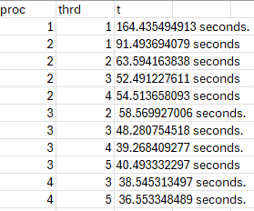
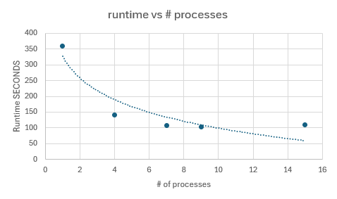

# System Programming Lab 11 Multiprocessing

## my implementation
-first thing to do was figure out how the mandel program worked
-once i figured that out i set my program to focus on computing a spot of intrest
-i have a generate command that gets all the current frame parameters and calls the mandel program to create frame point in our data set
-i then get the number of processes the user wants and store as an int
-i then played around trial and error with stepping sizes till i got something that looked cool.
-then i forked for each frame creating a child process to copute that frame based on how many processes the uer specifed 
-parent manages number of active processes 
-then i pretty much just limit the number of processes that can be running at once and this is how i achived the parellel processing 
-lab12 updates:
-multiple threads: difficult to coordinate 
-i implemented it so where each frame is divided into regions which are processed by the diffrent threads 
- the thread data struct holds the info for the threads 
-iterations at point is the calc of the number of iterations it takes for a point to escape scope of the set, makes sure iterations stay in specifed region for calculation 
-1 more command line arg simaliar functionality to lab 11 

## RESULTS:  ->
-program was slow to compute the fastest time achived to compute 100 frames was 103.89 seconds with 9 processors
-I can attribute some error to my laptop being very bad and being very glitchy/laggy
-also i can attribute error to having a bunch of tabs open while computing
-but the longest time for 1 process to create the 100 frame set was 359 seconds, so multi-processesing definatly made a diffrence

## lab 12 results ->
-prgm was much faster 
- highest efficency 4 process 5 threads, this is due to it matching the best with the hadware 
-the extremes of both ends limited efficency 
- multithreading seemed to effect runtime more due to it being able to lower the time it takes to generate a single frame decreasing runtime the most
## lab 12 graph

### graph:

